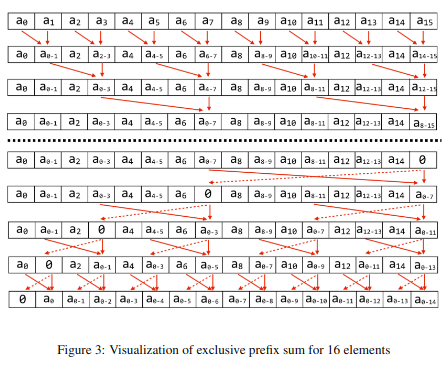
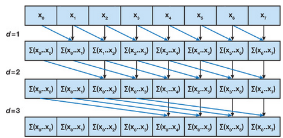

Parallel algorithms can run much faster than serial ones, but coming up with a work-efficient parallel algorithm can be difficult. One must also know about the computation units, memory and scheduling policy, to get the best performance.

In this section, following course materials from CMU's parallel computing course, I  write a parallel CUDA program to find peaks of a given integer array.

## Parallel Exclusive Prefix Sum
The core of the algorithm is the parallel-exclusive-prefix-sum algorithm, which calculates prefix sum of an array in a parallel manner. 

It is a work efficient algorithm of complexity **O(N)**, on par with the serial version.

## Using Shared Memory and Warps
**Shared memory** is much faster to access than global memory, and are shared by (~512) threads in a block. **Warps** are units of work scheduling, consisting of 32 consecutive threads which are executed on a SIMT fashion.

I implement a simpler, though not as work-efficient, parallel prefix sum algorithm using shared memory and warps.

This algorithm has work efficiency of **O(NLogN)**. 

## Find Peaks of an Array
There are ***tons of*** useful applcations of prefix sum, and I implement an algorithm to find the peaks of an array.

